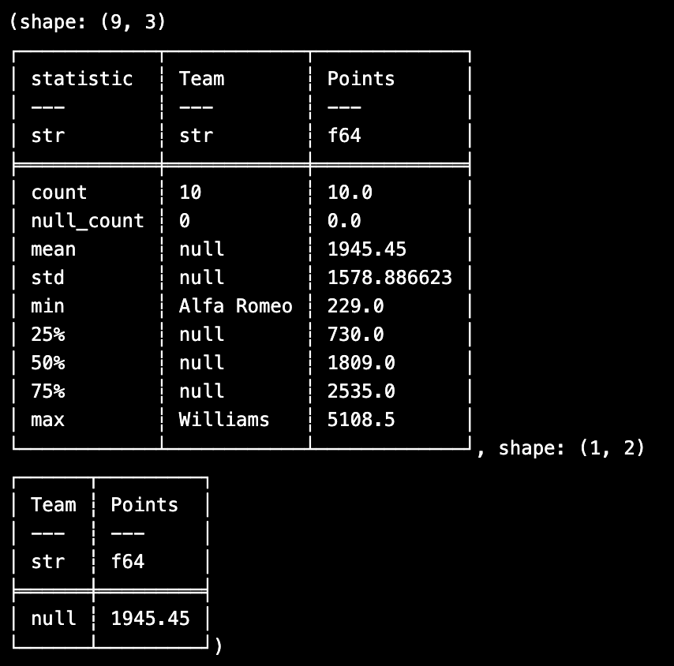
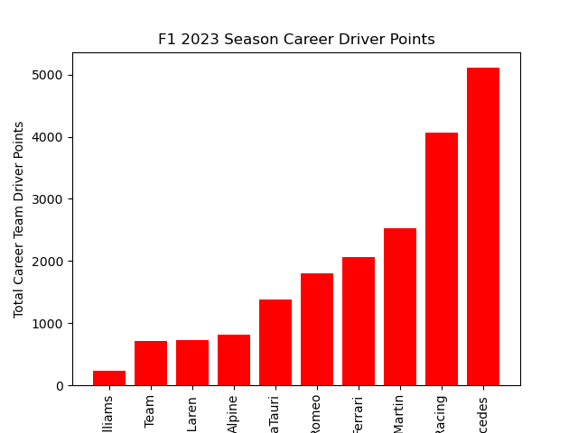
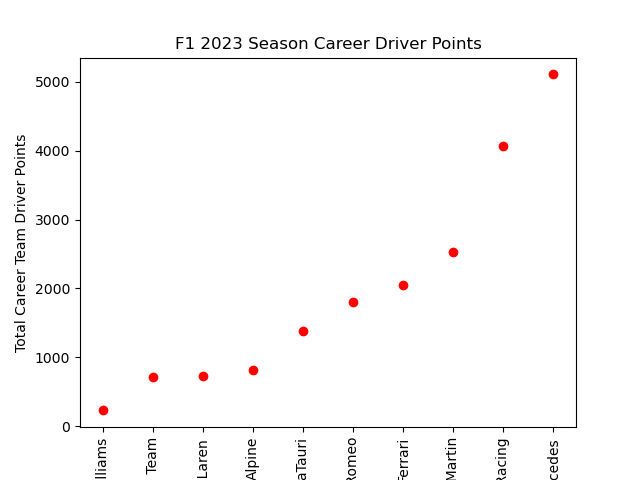

# Danish Maknojia Mini Project 3

[](https://github.com/nogibjj/Maknojia_DanishMP3/actions/workflows/cicd.yml)

## Objectives
My project accomplishes the following tasks:
-- Python script using Polars for descriptive statistics
-- Read a dataset (CSV or Excel)
-- Generate summary statistics (mean, median, standard deviation)
-- Create at least one data visualization

# Directory Tree

```plaintext
├── F1Main.jpeg
├── Formula1_2023season_drivers.csv
├── Makefile
├── README.md
├── barchart.png
├── lib.py
├── mainfile.py
├── mainjupyter.ipynb
├── requirement.txt
├── scatter.png
├── stats.png
├── test.py
├── test_file.csv
└── test_lib.py
```

## Data Set


- Formula1_2023season_drivers.csv is a dataset with the career driver statistics up to 2023 for active F1 drivers

## Project Content

- The project contains the main file, which opens Formula1_2023season_drivers.csv, groups the data by team & country, and sorts in ascending order. Next, a summary of statistics (for team and points) is generated containing the mean, median (50%) & standard deviation, and two graphs are generated: one bar chart, and second a scatter graph

## Summary Statistics


## Bar Chart


## Scatter Plot



